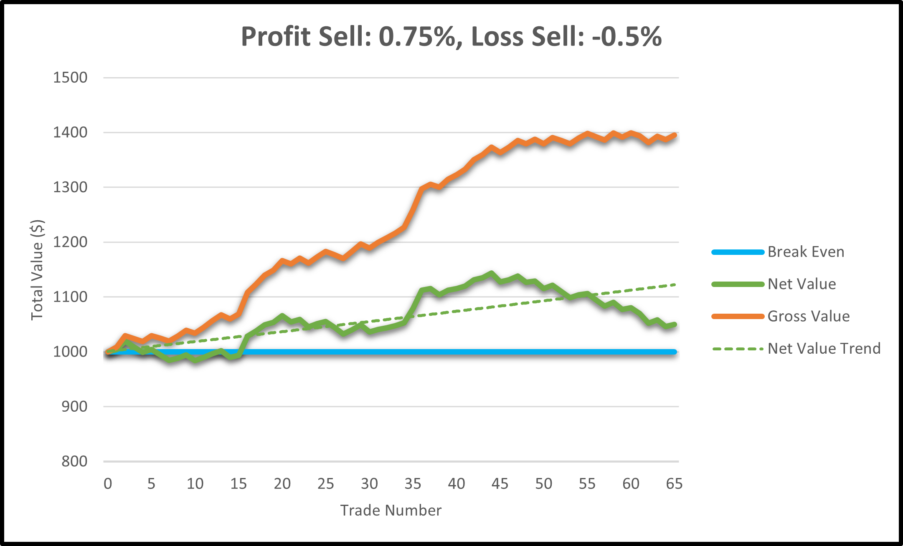
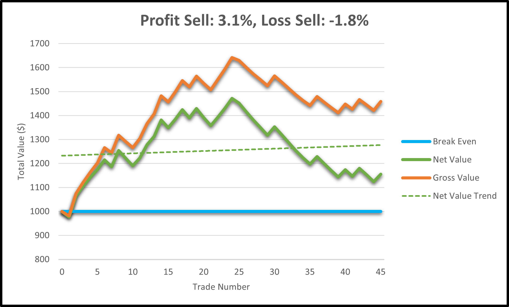

# Automatic Crypto Trader


## Introduction
This project is a high-frequency cryptocurrency trading bot designed for educational purposes. It leverages near real-time 
quotes from Yahoo Finance, targeting cryptocurrencies available on [Loopring's Layer 2 crypto exchange](https://loopring.org/#/), 
and uses the nominal 0.25% swap fee found on the exchange. The bot is equipped with features such as manual and automatic 
calibration of profit/loss sell thresholds based on historical data, and the ability to save trade history to Excel for 
analysis. This version is a simulation and does not support actual trading on Loopring.


## Installation
### Prerequisites
- Python 3.9
- Windows 10 (The code may work on other operating systems, but has been tested on Windows 10)

### Setting Up a Virtual Environment
To avoid conflicts with other Python projects or system-wide packages, it's recommended to use a virtual environment. If you have Python 3.9 installed, you can set up a virtual environment as follows:

1. **Create a Virtual Environment:**
   
   Navigate to your project's directory in a terminal and run:
   ```bash
   python -m venv venv
   ```
3. **Activate the Virtual Environment:**
   - **On Windows:**
     ```bash
     .\venv\Scripts\activate
     ```
   - **On Linux and macOS:**
     ```bash
     source venv/bin/activate

4. **Install the Requirements:**

   With the virtual environment activated, install the required packages using:
   ```bash
   pip install -r requirements.txt
   ```

## Running the Program
After setting up the environment and installing the dependencies, you can run the program from your project's directory with:
   ```bash
   python crypto_bot.py
   ```

## Usage
There are three modes to use with this code. Each mode can be turned on or off by adjusting the comments at the bottom
of the script.
### 1. Main
   The main mode will analyze the target cryptocurrencies over the previous 24 hours initially, and then every 60 minutes
   afterwards when selecting an asset to purchase. After it has made a purchase, it will analyze the price movement every
   minute over the last 15 minutes to evaluate short-term trends and decide if it should keep holding or sell and try again
   under more favourable conditions. Once per day, it will analyze the performance of each cryptocurrency over the last 
   24 hours to observe any new developments and adjust itself accordingly.

### 2. Calibration
   The historical calibration mode is used to analyze the performance of profit/loss sell threshold values over the previous week. 
   It will run a comprehensive analysis and return various metrics to evaluate the profitability of each configuration 
   while storing the results in an Excel file. The combination of thresholds that would have yielded the greatest profit 
   will be copied to the last row in the file and can be used as a "best guess" for the following week. However, it 
   should be noted that historical performance is not an indication of future results so there is no guarantee to achieve
   the same profit.

### 3. Test
   This is a sandbox mode to test new ideas and concepts while still using the same framework the trading bot uses.

## Sample Results
Since this bot is meant to trade at high-frequencies, it uses very short-term trends to make its decisions. When choosing
to buy a cryptocurrency, if the bot has determined the overall trend is rising and the current price is greater than the 
previous two times it has checked the price, it will purchase what was previously determined to be the most volatile asset. 
After it has acquired an asset, it will sell it either for a profit or for a loss based on the previously determined 
thresholds that were either calibrated with historical data or manually provided by the user. Note that 0.25% is taken as 
a fee each time an asset is swapped resulting in a total fee of 0.5% per trade.

The cryptocurrencies traded during the following examples were "AAVE-USD", "LINK-USD", "CRV-USD", "ENS-USD", "ETH-USD", 
and "LRC-USD". Here are some sample results that were achieved by starting with $1000 on each run:

### Sample 1: Manual Calibration

>Trading results between January 12, 2023 and January 14, 2023.

Using a manually-selected profit sell threshold of 0.75% and a loss sell threshold of -0.5%, this graph shows a net positive 
profit trend for the given time period. The gross value, which includes the cost of the fees added to the net value, suggests 
that the bot may do well enough to cover the cost of trading while also making a small profit. 

### Sample 2: Historical Calibration

>Trading results between February 13, 2023 and March 1, 2023.

After automatically calibrating the profit sell and loss sell thresholds with historical data, they were determined to 
be 3.1% and -1.8%, respectively. This noticeably reduced the trade frequency which caused the bot to hold onto the assets
longer.


## Disclaimer
This project is for educational purposes only and should not be considered financial advice of any kind. Should this 
program be adapted to be used with real money, it is done at the user's own risk. Loopring has no direct association with 
this project.


